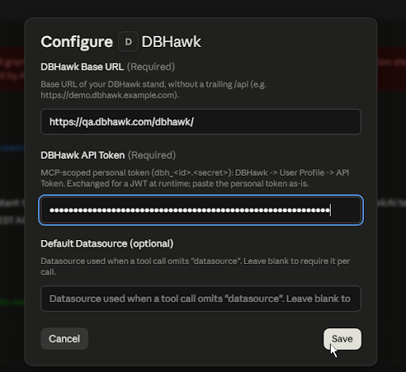

# Installing the DBHawk extension for Claude Desktop

A step-by-step guide for end users: how to install the **DBHawk** extension (`.mcpb`) in
Claude Desktop and connect it to your DBHawk stand. You install it from a file and configure it
through a graphical form — no manual config editing.

> The extension works **on its own** — you do **not** need Claude Code or the marketplace plugin.

---

## What you'll need

- **Claude Desktop** (a recent version) — the desktop app for Windows or macOS.
- **Your DBHawk URL** — the base URL of the stand, e.g. `https://demo.dbhawk.example.com`
  (without a trailing `/api`).
- **A personal DBHawk API token** in the form `dbh_<id>.<secret>` (see Step 1).
- The token owner needs the `ACCESS_TO_DATA` permission and membership in the MCP access group.

---

## Step 1. Get an API token in DBHawk

1. Sign in to DBHawk with your account.
2. Go to **User Profile → API Token**.
3. Create (or copy an existing) token. It looks like `dbh_...` — copy the whole value.

> You enter the token once in the extension's form; it is stored in your OS secure storage (keychain).
> Don't share it in chats or commit it to a repository.

---

## Step 2. Download the extension file

1. Open the releases page:
   <a href="https://github.com/datasparc/dbhawk-mcp-plugin/releases" target="_blank" rel="noopener noreferrer"><strong>https://github.com/datasparc/dbhawk-mcp-plugin/releases</strong></a>
2. In the latest release, under **Assets**, download `dbhawk-<version>.mcpb`
   (for example, `dbhawk-0.2.0.mcpb`).

---

## Step 3. Open Extensions in Claude Desktop

1. Launch Claude Desktop.
2. Open **Settings**.
3. In the left menu, under **Desktop app**, select **Extensions**.

---

## Step 4. Install the extension from the file

1. Click **Advanced settings**.
2. Click **Install** (Install extension / Install from file).
3. Choose the `dbhawk-<version>.mcpb` file you downloaded in Step 2.

> Alternative: just **drag and drop** the `.mcpb` file onto the Extensions window.

---

## Step 5. Fill in the connection settings

After installation, Claude Desktop shows the DBHawk extension's settings form with these fields:

| Field | What to enter |
|---|---|
| **DBHawk Base URL** | The base URL of the stand, without `/api` (e.g. `https://demo.dbhawk.example.com`) |
| **DBHawk API Token** | The `dbh_...` token from Step 1 (input is masked) |
| **Default Datasource** *(optional)* | A default datasource; you can leave it blank |

Fill in the fields and **save**. Make sure the extension is **enabled** (the toggle is on).



---

## Step 6. Verify it works

1. Open a **new chat** in Claude Desktop.
2. Confirm the DBHawk tools are connected (the tools/connector icon in the input box).
3. Send a request that triggers a tool, for example:

   > Which datasources do I have in DBHawk?

4. Claude calls the `list_datasources` tool and returns your list of datasources — that means the
   connection, URL, and token all work.

---

## Updating to a new version

Claude Desktop does **not** auto-update file-installed extensions. To upgrade:

1. Download the new `dbhawk-<new-version>.mcpb` from the Releases page.
2. Install it the same way as in Steps 3–4 — it replaces the previous version.
3. Your settings (URL/token) are usually kept; check them in the form if needed.

---

## Troubleshooting

| Symptom | Cause / what to do |
|---|---|
| **Missing configuration** on startup | Base URL or API Token is empty — open the form and check. |
| **token exchange failed: 401/403** | The token is wrong, revoked, or expired; or the user isn't in the MCP access group. For SSO/SAML users, sign in to DBHawk once via your IdP, then the token works again. Reissue it if needed. |
| **DBHawk API 401/403** (after exchange) | Wrong scope, or the user lacks `ACCESS_TO_DATA`. |
| **Only read-only statements…** | A write/DDL statement was attempted — this is expected; MCP is read-only. |
| **No DBHawk tools in chat** | Check that the extension is enabled; look at the card's status in **Extensions** and the logs under **Settings → Developer**. |

MCP logs in Claude Desktop (Windows):
```
%APPDATA%\Claude\logs\
```

macOS:
```
~/Library/Logs/Claude/
```

---

<sub>Exact screen labels and menu names may vary slightly depending on your Claude Desktop version.</sub>
